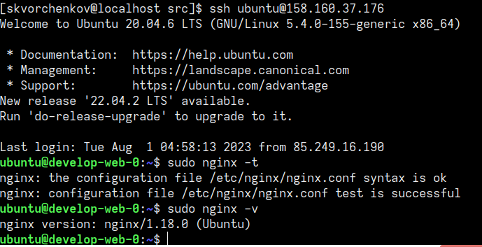
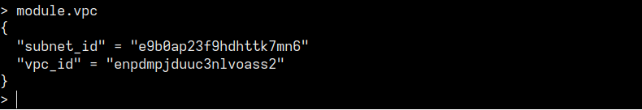

# Домашнее задание к занятию "Продвинутые методы работы с Terraform"

## Задача 1
1. Возьмите из [демонстрации к лекции готовый код](https://github.com/netology-code/ter-homeworks/tree/main/04/demonstration1) для создания ВМ с помощью remote-модуля.
2. Создайте одну ВМ, используя этот модуль. В файле cloud-init.yml необходимо использовать переменную для ssh-ключа вместо хардкода. Передайте ssh-ключ в функцию template_file в блоке vars ={} .
Воспользуйтесь [**примером**](https://grantorchard.com/dynamic-cloudinit-content-with-terraform-file-templates/). Обратите внимание, что ssh-authorized-keys принимает в себя список, а не строку.
3. Добавьте в файл cloud-init.yml установку nginx.
4. Предоставьте скриншот подключения к консоли и вывод команды ```sudo nginx -t```.

------
## Ответ:
- [cloud-init.yml](04/src/cloud-init.yml) 

Педеача ssh-ключа в main.tf:

<details>
<summary>Часть кода в main.tf:</summary>

```sh
data template_file "userdata" {
  template = file("${path.module}/cloud-init.yml")

  vars = {
    ssh_public_key = file("~/.ssh/id_rsa.pub")
  }
}
```   
</details>

Скриншот:

 


## Задача 2
1. Напишите локальный модуль vpc, который будет создавать 2 ресурса: **одну** сеть и **одну** подсеть в зоне, объявленной при вызове модуля, например: ```ru-central1-a```.
2. Вы должны передать в модуль переменные с названием сети, zone и v4_cidr_blocks.
3. Модуль должен возвращать в root module с помощью output информацию о yandex_vpc_subnet. Пришлите скриншот информации из terraform console о своем модуле. Пример: > module.vpc_dev  
4. Замените ресурсы yandex_vpc_network и yandex_vpc_subnet созданным модулем. Не забудьте передать необходимые параметры сети из модуля vpc в модуль с виртуальной машиной.
5. Откройте terraform console и предоставьте скриншот содержимого модуля. Пример: > module.vpc_dev.
6. Сгенерируйте документацию к модулю с помощью terraform-docs.    
 
Пример вызова

```
module "vpc_dev" {
  source       = "./vpc"
  env_name     = "develop"
  zone = "ru-central1-a"
  cidr = "10.0.1.0/24"
}
```

## Ответ:
Файлы:  
- [Модуль VPC](04/src/vpc)  
- [main.tf](04/src/main.tf)
- [Документация к модулю VPC](04/src/vpc/README.md)

Скриншоты:

 

## Задача 3

1. Выведите список ресурсов в стейте.
2. Полностью удалите из стейта модуль vpc.
3. Полностью удалите из стейта модуль vm.
4. Импортируйте всё обратно. Проверьте terraform plan. Изменений быть не должно.
Приложите список выполненных команд и их результаты.

## Ответ:

<details>
<summary>Вывод комманд:</summary>

```sh

[skvorchenkov@localhost src]$ terraform state list
data.template_file.userdata
module.test-vm.data.yandex_compute_image.my_image
module.test-vm.yandex_compute_instance.vm[0]
module.vpc.yandex_vpc_network.net_name
module.vpc.yandex_vpc_subnet.subnet_name
[skvorchenkov@localhost src]$ terraform state show module.vpc.yandex_vpc_network.net_name
# module.vpc.yandex_vpc_network.net_name:
resource "yandex_vpc_network" "net_name" {
    created_at = "2023-08-08T19:07:47Z"
    folder_id  = "b1gdgnothmd86ut0ulgu"
    id         = "enppotfa10pa73t7tnpk"
    labels     = {}
    name       = "develop"
    subnet_ids = []
}
[skvorchenkov@localhost src]$ terraform state show module.vpc.yandex_vpc_subnet.subnet_name
# module.vpc.yandex_vpc_subnet.subnet_name:
resource "yandex_vpc_subnet" "subnet_name" {
    created_at     = "2023-08-08T19:07:49Z"
    folder_id      = "b1gdgnothmd86ut0ulgu"
    id             = "e9b45k2rr5g67ad4bl9r"
    labels         = {}
    name           = "develop-ru-central1-a"
    network_id     = "enppotfa10pa73t7tnpk"
    v4_cidr_blocks = [
        "10.0.1.0/24",
    ]
    v6_cidr_blocks = []
    zone           = "ru-central1-a"
}
[skvorchenkov@localhost src]$ terraform state rm 'module.vpc'
Removed module.vpc.yandex_vpc_network.net_name
Removed module.vpc.yandex_vpc_subnet.subnet_name
Successfully removed 2 resource instance(s).
[skvorchenkov@localhost src]$ terraform import module.vpc.yandex_vpc_network.net_name enppotfa10pa73t7tnpk
data.template_file.userdata: Reading...
data.template_file.userdata: Read complete after 0s [id=a01fbf4b48c1e258b11abe5636ef51abbfdd3b77c3120085c2d0594cd9ae7a58]
module.vpc.yandex_vpc_network.net_name: Importing from ID "enppotfa10pa73t7tnpk"...
module.vpc.yandex_vpc_network.net_name: Import prepared!
  Prepared yandex_vpc_network for import
module.vpc.yandex_vpc_network.net_name: Refreshing state... [id=enppotfa10pa73t7tnpk]
module.test-vm.data.yandex_compute_image.my_image: Reading...
module.test-vm.data.yandex_compute_image.my_image: Read complete after 1s [id=fd8h5v894psivbl4t2dn]

Import successful!

The resources that were imported are shown above. These resources are now in
your Terraform state and will henceforth be managed by Terraform.
[skvorchenkov@localhost src]$ terraform import module.vpc.yandex_vpc_subnet.subnet_name e9b45k2rr5g67ad4bl9r
data.template_file.userdata: Reading...
data.template_file.userdata: Read complete after 0s [id=a01fbf4b48c1e258b11abe5636ef51abbfdd3b77c3120085c2d0594cd9ae7a58]
module.test-vm.data.yandex_compute_image.my_image: Reading...
module.vpc.yandex_vpc_subnet.subnet_name: Importing from ID "e9b45k2rr5g67ad4bl9r"...
module.vpc.yandex_vpc_subnet.subnet_name: Import prepared!
  Prepared yandex_vpc_subnet for import
module.vpc.yandex_vpc_subnet.subnet_name: Refreshing state... [id=e9b45k2rr5g67ad4bl9r]
module.test-vm.data.yandex_compute_image.my_image: Read complete after 1s [id=fd8h5v894psivbl4t2dn]

Import successful!

The resources that were imported are shown above. These resources are now in
your Terraform state and will henceforth be managed by Terraform.
[skvorchenkov@localhost src]$ terraform plan
data.template_file.userdata: Reading...
data.template_file.userdata: Read complete after 0s [id=a01fbf4b48c1e258b11abe5636ef51abbfdd3b77c3120085c2d0594cd9ae7a58]
module.test-vm.data.yandex_compute_image.my_image: Reading...
module.vpc.yandex_vpc_network.net_name: Refreshing state... [id=enppotfa10pa73t7tnpk]
module.test-vm.data.yandex_compute_image.my_image: Read complete after 1s [id=fd8h5v894psivbl4t2dn]
module.vpc.yandex_vpc_subnet.subnet_name: Refreshing state... [id=e9b45k2rr5g67ad4bl9r]
module.test-vm.yandex_compute_instance.vm[0]: Refreshing state... [id=fhmh4i0k1063ao21vvth]

No changes. Your infrastructure matches the configuration.

Terraform has compared your real infrastructure against your configuration and
found no differences, so no changes are needed.

```   
</details>